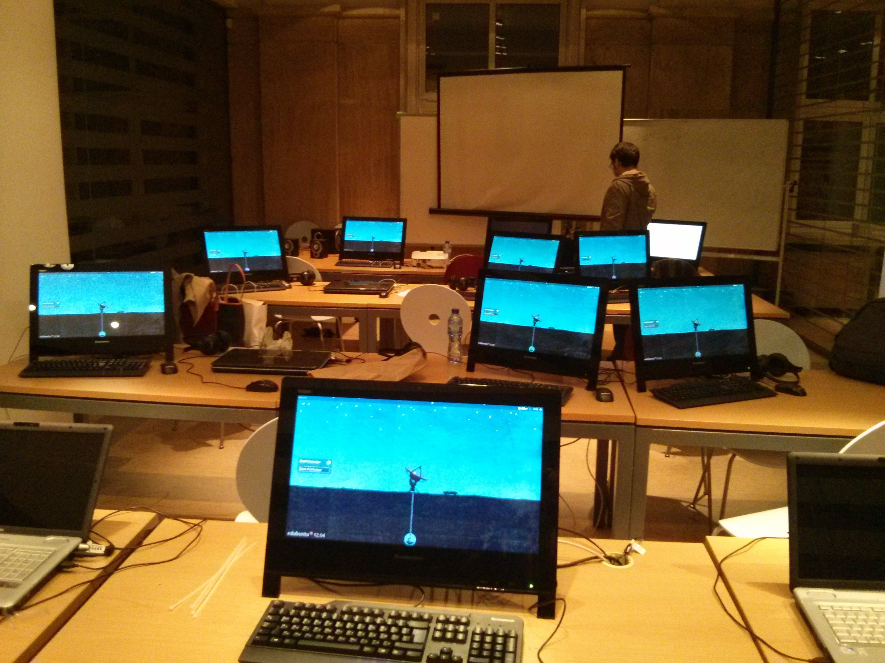

+++
author = "Blagovest Petrov"
title = "Ubuntu 12.04 Desktop with Zentyal 3.2"
date = "2013-10-04"

tags = [
    "zentyal",
    "system administration",
    "ldap",
    "nfs",
    "Ubuntu",
    "Desktop"
]
categories = [
    "System Administration",
    "Linux"
]
+++

[Zentyal](http://zentyal.org), The Linux Small Business Server includes the most important services for a small or medium company. Most of the services are integrated around OpenLdap. Since version 3.1, Zentyal uses Samba4 as a Directory and File Sharing services.


I'm maintaining the computers in the Francophone center in University of Sofia. Everything in this place is with Ubuntu workstations.

There was a major hardware update this year. We got new servers, workstations and laptops. 




Following the info from [this](http://forum.zentyal.org/index.php?topic=12925.0) forum topic, I installed Ubuntu 12.04 LTS for the desktops and Zentyal 3.2 as a Directory and file server. Home directories are on NFS share in Zentyal, so that the users can use their own profiles on any workstation. 

First I decided to use Centrify DC Express ([Documentation](https://help.ubuntu.com/community/DirectControl)) as an Active Directory client Samba shares, like in the forum topic. This type of setup gave me the   possibility to use Samba 4's advanced directory options because CentrifyDC immitates M$ Windows client and the security of Samba. It seemed to work in the first test, but then bugs appeared. There are some privilege issues with Samba. For example, PulseAudio cannot initialize on boot because it cannot create the `~/.pulse` directory. There were the simmilar issues with Firefox on some of the profiles.

Then I decided to use NFS with Centrify but another issue appeared. Centrify makes UID and GID different than the ones in Zentyal and users cannot write to their own profiles. NFSv4 can solve this problem with remapping, but it's still not documented and there's a lack of information on internet. If you are interested in it, you can search for `/etc/idmapd.conf`. 

So, I choosed the standard LDAP setup, like in the forum topic and NFS. Well, [another bug](https://bugs.launchpad.net/ubuntu/+source/at-spi2-core/+bug/870874) appeared but it can be fixed with a small hack. 

You must comment the "If" statement about gsettings (dconf) in `/etc/X11/Xsession.d/90qt-a11y` :

```bash
# -*- sh -*-
# Xsession.d script to set the QT_ACCESSIBILITY env variable when accessibility
# is enabled.
#
# This file is sourced by Xsession(5), not executed.

if [ -x "/usr/bin/gsettings" ]; then
        a11y_enabled=$(gsettings get org.gnome.desktop.interface toolkit-accessibility)
        if [ "$a11y_enabled" = "true" ]; then
                export QT_ACCESSIBILITY=1
        fi
fi
```

```bash
# -*- sh -*-
# Xsession.d script to set the QT_ACCESSIBILITY env variable when accessibility
# is enabled.
#
# This file is sourced by Xsession(5), not executed.

#if [ -x "/usr/bin/gsettings" ]; then
#        a11y_enabled=$(gsettings get #org.gnome.desktop.interface toolkit-accessibility)
#        if [ "$a11y_enabled" = "true" ]; then
#                export QT_ACCESSIBILITY=1
#        fi
#fi
```

According to the forum topic, you need to install these packages on the Ubuntu client to run LDAP:


```bash
$ sudo apt-get install install libnss-ldap libpam-ldap libpam-mount  winbind smbclient cifs-utils ldap-utils #Ignore all requests, just hit Enter
```


And for NFS:

```bash
$ sudo apt-get install nfs-common libpam-mount
```

Then, create again the file `/etc/ldap.conf` :

```ldap
base dc=neo,dc=lan

uri ldap://10.1.100.1:390

ldap_version 3

binddn cn=zentyalro,dc=neo,dc=lan
bindpw jw4xF8KRS@IsEqxCbt=0

scope sub
bind_policy soft
pam_password md5

nss_base_passwd         ou=Users,dc=neo,dc=lan?one
nss_base_passwd         ou=Computers,dc=neo,dc=lan?one
nss_base_shadow         ou=Users,dc=neo,dc=lan?one
nss_base_group          ou=Groups,dc=neo,dc=lan?one
nss_schema              rfc2307bis
nss_map_attribute uniqueMember member
nss_reconnect_tries 2
nss_initgroups_ignoreusers avahi,avahi-autoipd,backup,bin,colord,daemon,games,gnats,hplip,irc,kernoops,libuuid,lightdm,list,lp,mail,man,messagebus,news,proxy,pulse,root,rtkit,saned,speech-dispatcher,sshd,sync,sys,syslog,usbmux,uucp,whoopsie,www-data
```

**Remarks:**

* base - see "Users and Groups - LDAP settings - LDAP information - Base DN (in the Zentyal web frontend)
* uri - use the IP address of your Zentyal box and Port 390 to reach Ldap
* binddn - run grep ^binddn /etc/ldap.conf on your Zentyal server's shell
* bindpw - run grep ^bindpw /etc/ldap.conf on your Zentyal server's shell

Create a link for the `ldapsearch` tool:

```bash
$ sudo ln -s /etc/ldap.conf  /etc/ldap/ldap.conf
```

For NSS: 

```bash
$ sudo auth-client-config -t nss -p lac_ldap
```

You can test the configuration with `$id USERNAME` where the username must be from the Active Directory.

To mount the home folder you need to insert this line in your `/etc/security/pam_mount.conf` between `\<!-- Volume definitions --\>` tags:

```bash
<volume fstype="nfs" server="yourserver.local" path="/home/%(USER)" mountpoint="~" options="rsize=8192,wsize=8192,timeo=14,intr,proto=tcp,nolock" />
```

* It's better to use TCP because sometimes transferring big files freezes.
* Nolock disables file locking. According to the manpages, this option is deprecated and is required just for an older servers. I think it's better to be used because sometimes Firefox locks it's profile when the session freezes and the users cannot login from other machines.
* rsize and wsize specifies the chunks of data that the client and server pass back and forth to each other.

This configuration works for me, but maybe the `options=` tag must be in `<mntoptions>` tag.

**About the server**

Zentyal is well documented. You can install and configure all the needed components in ~30 minutes. Just check [Zentyal.org](http://zentyal.org).
Additionaly, you need to configure the NFS server. These packages must be installed:

```bash
$ sudo apt-get install nfs-kernel-server nfs-common
```

Then, configure the `/etc/exports` file. Just add this line:

```bash
/home   10.10.10.0/24(rw,sync,no_subtree_check)
```

Where `10.10.10.0/24` must be your network and netmask.

There are many advanced NFS options. Experiment, if you want :) NFSv4 even supports Kerberos authentication, but it's still undocumented.

Everything should work with this setup. If you login to the client with AD username, you can see this:

```bash
cfadmin@lenovo5:~$ su blagovest
Mot de passe : 
blagovest@lenovo5:/home/cfadmin$ cd
blagovest@lenovo5:~$ df -h
df: «/var/lib/lightdm/.gvfs»: Permission non accordée
Sys. de fichiers      Taille Utilisé Dispo Uti% Monté sur
/dev/sda1               230G    6,3G  212G   3% /
udev                    1,9G    4,0K  1,9G   1% /dev
tmpfs                   744M    896K  743M   1% /run
none                    5,0M       0  5,0M   0% /run/lock
none                    1,9G    144K  1,9G   1% /run/shm
cgroup                  1,9G       0  1,9G   0% /sys/fs/cgroup
cf.lo:/home/blagovest   351G    2,4G  331G   1% /home/blagovest
blagovest@lenovo5:~$ 
```

The home directory doesn't unmount sometimes, but it can be fine configured from `/etc/security_pam_mount.conf` . I will be glad if someone fix it :)
