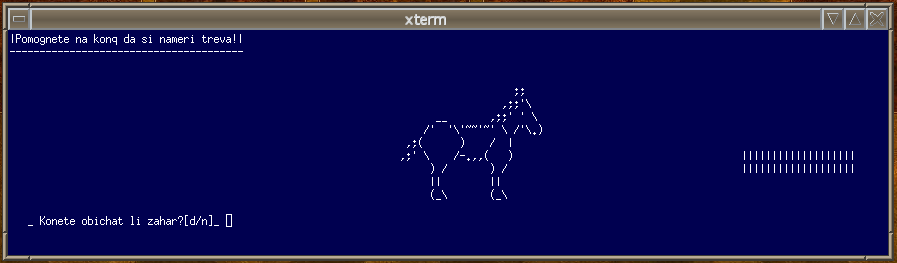

+++
author = "Blagovest Petrov"
title = "Horse - dummy school project"
date = "2013-10-04"

tags = [
    "Programming",
    "School",
    "C",
    "Bash",
]
categories = [
    "Programming"
]
+++

Just a small dummy **C** project from the highschool, made probably in 2008. It's completely useless. I still keep it as a good example of using an **escape characters** in **Bash**.

The code is hosted [here](https://code.petrovs.info/cemetery/Horse)