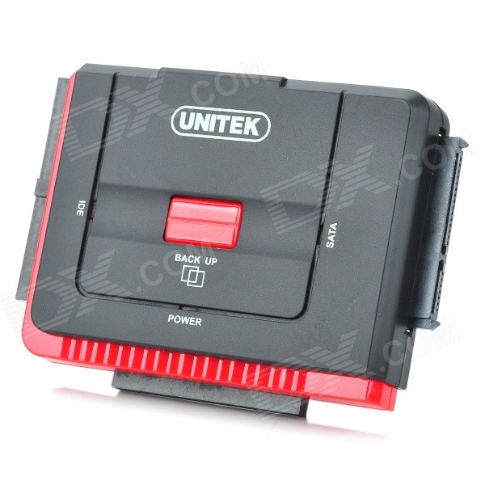
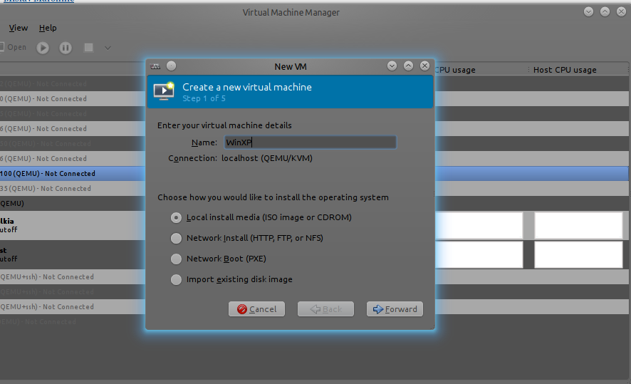
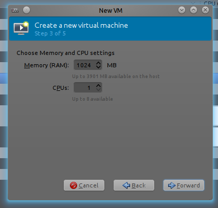
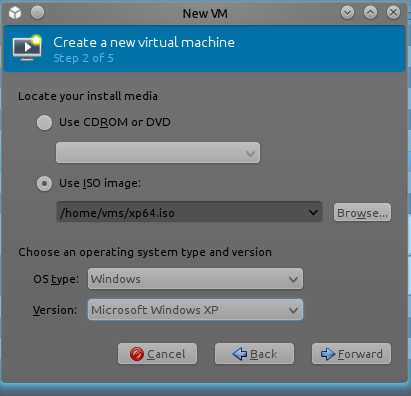
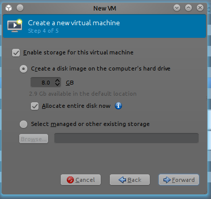
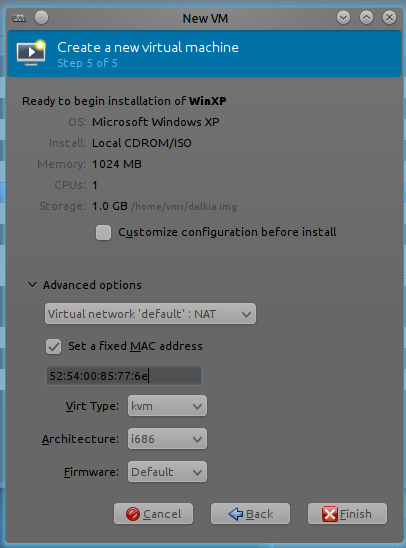
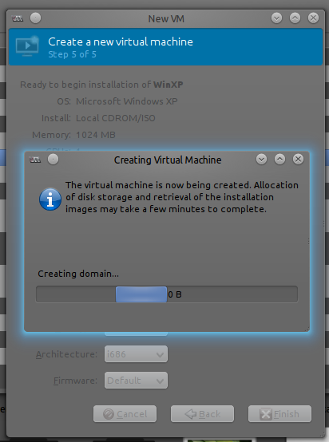

+++
author = "Blagovest Petrov"
title = "Virtualize a broken Windows XP machine with KVM or Xen, Part1"
date = "2013-11-03"

tags = [
    "Windows",
    "Virtualization",
]
categories = [
    "System Administration",
]
+++

 There are a lot of dirty legacy Personal Computers which are online and cannot be reinstalled. The most common problems are that they are installed with a special software and the CDs are lost or licensing problems.

But what will happen when your zombie Durom dies? And your boss wants to use the accounting software ASAP.. The best scenario is when your HDD is healthy 🙂

First, you shoud find a cheap HDD -> USB converter. This is the clearest solution because I don’t want to turn off my virtual hypervisors and probably, the old machine would have an IDE HDDs. Chinese combined IDE/SATA -> USB converters can be found for 15-16$.



# IMPORTANT!

The old PC’s are too dirty and their cases are sharp and dangerous! You should have a DPT vaccine and suitable protective clothing!!!

The HDD must be put on a PC with a hardware acceleration and KVM installed. In my case, my personal laptop was the salvation. I prepared a dummy VM with virt-manager, just to generate the XML file for libvirt. Use the simplest configuration. WinXP runs on an old hardware... Here are some steps in images:





Just one CPU with 1024Mb Ram is OK



It’s not necessary to have WinXP iso. Use something just to generate the XML for LibVirt.



The disk is also not revelant. It will be removed after the configuration.



Better use `i686` for Windows XP



Force off the machine after this window and open the terminal.


In the terminal, type `virsh dumpxml WinXp > WinXp.xml` . Open the generated text file with your text editor and find the following stanzas:

```xml
<disk type='file' device='disk'>
  <driver name='qemu' type='qcow2'/>
  <source file='/home/vms/WinXP.img'/>
  <target dev='hda' bus='ide'/>
  <alias name='ide0-0-0'/>
  <address type='drive' controller='0' bus='0' target='0' unit='0'/>
</disk>
<disk type='file' device='cdrom'>
  <driver name='qemu' type='raw'/>
  <source file='/home/vms/xp64.iso'/>
  <target dev='hdc' bus='ide'/>
  <readonly/>
  <alias name='ide0-1-0'/>
  <address type='drive' controller='0' bus='1' target='0' unit='0'/>
</disk>
```

Remove the whole stanza about the CD Rom and change the disk configuration like this:

```xml
<disk type='block' device='disk'>
  <driver name='qemu' type='raw'/>
  <source dev='/dev/sdX'/>
  <target dev='hda' bus='ide'/>
  <address type='drive' controller='0' bus='0' target='0' unit='0'/>
</disk>
```

`/dev/sdX` must be your hard drive, connected with the chinese gadget. Make sure it’s not mounted on the host system. Now your XP machine should run directly from the hard drive.