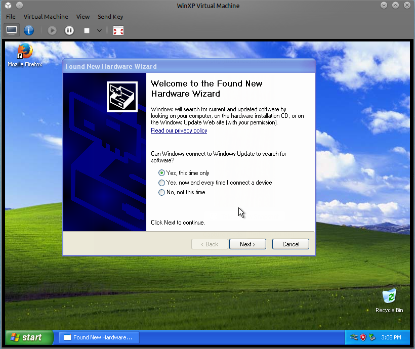
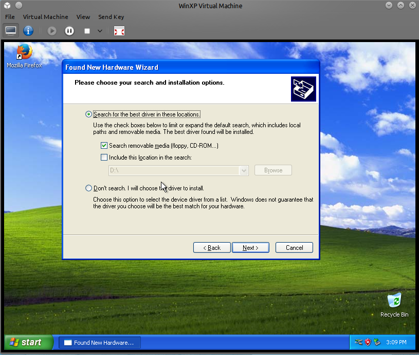
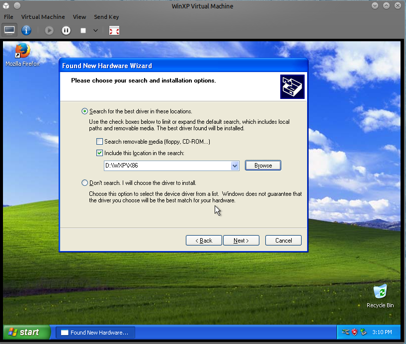
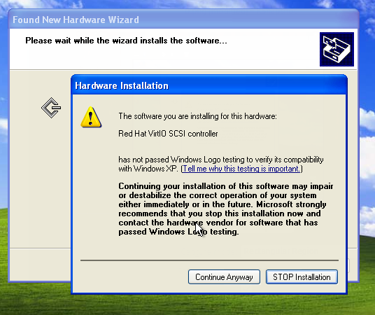
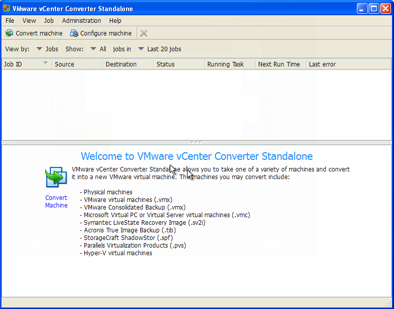
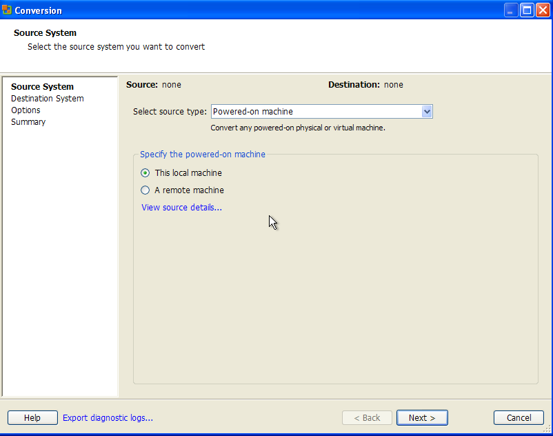
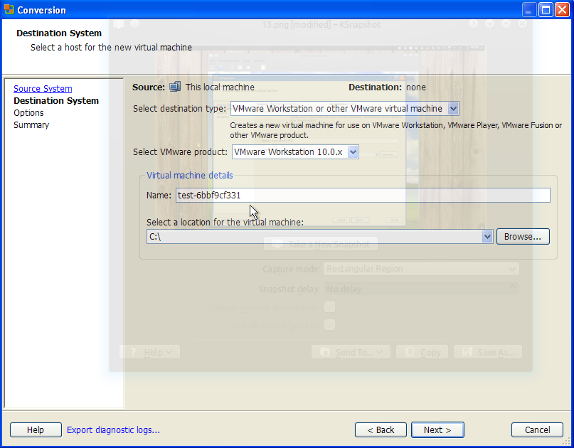
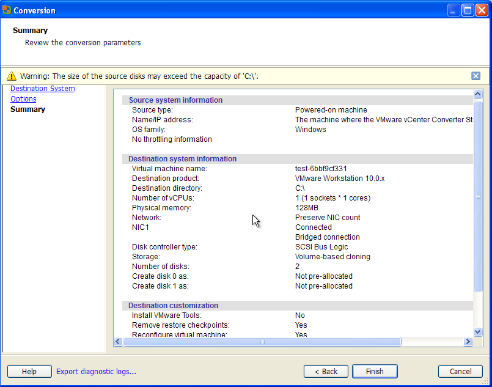

+++
author = "Blagovest Petrov"
title = "Virtualize a broken Windows XP machine with KVM or Xen, Part2"
date = "2013-11-08"

tags = [
    "Windows",
    "Virtualization",
]
categories = [
    "System Administration",
]
+++

It’s time to convert the physical disk to a virtual image. I’m using KVM/Qemu almost everywhere, so, this tutorial will be about KVM. You can use the images in Xen/VMWare almost the same way.

First, install the VirtIO drivers for a better performance. The Fedora team builds isos with binary executables. [Check the KVM documentation for the newest download links](http://www.linux-kvm.org/page/WindowsGuestDrivers/Download_Drivers).

First, attach a new VirtIO disk image to the machine. You can use the previously generated image in the installation from Part 1 or create a new one. The size is not important. It’s needed just to recognize the new storage format in Windows.












When it’s installed, you can deattach and delete the temporary VirtIO disk.

And now, the converting. I use mostly three tools for this thing:
 * [VMWare vCenter Converter](http://www.vmware.com/products/converter/) which is a free tool by VmWare;
 * CloneZilla - Open Source Linuxdistribution for creating disk images;
 * Byte copy with dd. I don' recommend it because will copy all of the sectors of the disk, even the "empty" ones. The dd way is OK when you will use LVM for a storage format.

I will show you how to convert it with the VmWare tool because It’s the easiest way, I think.

You need a free space somewhere to put the converted image from the tool. It’s possible to mount a directory from the server, to mount a Samba share or if the physical disk is healthy and there’s enough free space, you can put the image right in C:.



Click on “Convert machine”



This local machine



VmWare Workstation or other VmWare virtual machine; choose a directory



Summary...

And the job is running

When its finished, you will have a directory with the VMDK image in it. KVM supports VMDK but it’s better to convert it to QCOW2 with:

```bash
qemu-img convert -O qcow2 WinXP.vmdk WinXP.qcow2
```