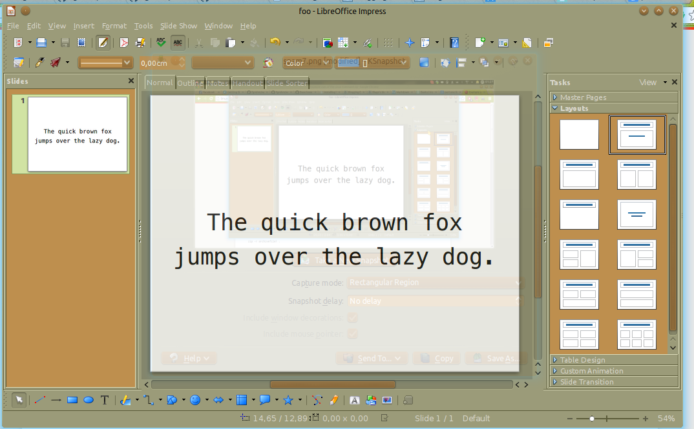

 +++
author = "Blagovest Petrov"
title = "Perl in the office"
date = "2014-01-17"

tags = [
    "Perl",
    "Regex"
]
categories = [
    "Hacks",
]
+++ 


Today Perl helped me again to solve a boring office problem. The colleagues gave me a presentation with almost 1000 slides. It was designed for a theatre subtitles. The slides was simple. Just a sentence per each slide. Only the colors was mistaken. Not black on white but white on black. My colleagues spent hours in googling for M$ Office bulk color change function. Then something blinked in me. **It was Perl's Regex {}**. 
The new open Office formats - [ODF](http://en.wikipedia.org/wiki/OpenDocument) and [OOXML](http://en.wikipedia.org/wiki/Office_Open_XML) are both zipped XML files, binary media content and files with metadata. I converted the presentation to odt (It was still on PPT which is an old proprietary format) and then, just unzip it:

```bash
lin:/tmp/presentation$ unzip slides.odp 
Archive:  slides.odp
 extracting: mimetype                
  inflating: content.xml             
  inflating: META-INF/manifest.xml   
  inflating: set
  tings.xml            
  inflating: styles.xml              
  inflating: meta.xml                
  inflating: Thumbnails/thumbnail.png
```

The interesting file for me was **content.xml**. It's a verry big XML text file, so it's hard to be read both by a human and a text editor, but Sublime Text withstand. Because the slides were very simple, there was only one text style. So, here is the interesting XML stanza:

```xml
</style:paragraph-properties>
<style:text-properties fo:font-variant="normal" fo:text-transform="none" fo:color="#ffffff" 
style:text-line-through-type="none" style:text-line-through-style="none" style:text-line-through-width="auto" 
style:text-line-through-color="font-color" style:text-position="0% 100%" fo:font-size="0.25in" style:font-size-asian="0
.25in" style:font-size-complex="0.25in" fo:letter-spacing="0in" fo:font-style="normal" style:font-style-asian="normal"
 style:font-style-complex="normal" style:text-underline-type="none" 
 style:text-underline-style="none" style:text-underline-width="auto" style:text-underline-color="font-color" 
 fo:font-weight="normal" style:font-weight-asian="normal" style:font-weight-complex="normal" 
 style:text-underline-mode="continuous" style:letter-kerning="false"/>
 </style:style>
 ```

 I just changed `fo:color="#ffffff"` to `fo:color="#000000"` with a Perl oneliner:

 ```bash
 lin:/tmp/presentation$ perl -p -i -e 's/fo:color=\"#ffffff\"/fo:color=\"#000000\"/g' content.xml
 ```

 And then, zip again to odp...

 ```bash
 lin:/tmp/presentation$ zip foo.odp content.xml meta.xml mimetype settings.xml styles.xml 
  adding: content.xml (deflated 97%)
  adding: meta.xml (deflated 47%)
  adding: mimetype (deflated 6%)
  adding: settings.xml (deflated 37%)
  adding: styles.xml (deflated 97%)
lin:/tmp/presentation$ zip -r foo.odp META-INF
  adding: META-INF/ (stored 0%)
  adding: META-INF/manifest.xml (deflated 71%)
lin:/tmp/presentation$ zip -r foo.odp Thumbnails
  adding: Thumbnails/ (stored 0%)
  adding: Thumbnails/thumbnail.png (deflated 4%)
```

And.. voilà! 

  