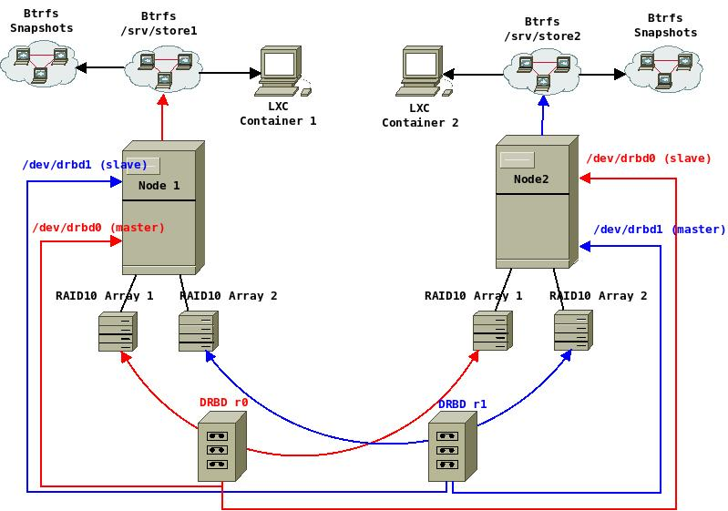

 +++
author = "Blagovest Petrov"
title = "Manual HA Failover Cluster with Linux Containers, DRBD and Btrfs"
date = "2014-01-17"

tags = [
    "DRBD",
    "BTRFS",
    "High Availability"
]
categories = [
    "System Administration",
]
+++ 

In this post I'm going to explain you how to deploy really fast and cheap cluster of Linux Containers. I use the same setup in a production enviroment for a big ERP system with accounting data (10GB++ of MySQL). 



Why [LXC](https://linuxcontainers.org/)? Because it is Über-cool! Compared to the Hardware Virtualization, the runtime performance is near the bare metal speeds. Operations like starting/stopping of the system or clonning and snapshots are really fast. There's no virtual BIOS, boot loader and kernel. A given number of containers can share the same system resources as they are installed on the same bare metal system and are still isolated. It's really lightweight and flexible. You can containerize everything - a whole system or a single application. [Stéphane Graber](https://www.stgraber.org/2013/12/27/lxc-1-0-container-storage/) has a really good blog post series about LXC.

[DRBD](http://www.drbd.org/) will provide the block device replication between the servers. Let's think of it as a RAID1 array between the two machines. It can work as master-master or master-slave. The master-master setup is more risky and it works only with shared cluster file systems (GFS, OCFS2 or GlusterFS). I don't have the balls to use it master-master on two nodes for VM's and containers, so in this setup I'll use master-slave. The difference is that when an array is promoted as slave on a given machine, it cannot be accessed.

[Btrfs](https://btrfs.wiki.kernel.org/index.php/Main_Page) is the new hipster in town :) It's a quite new "copy on write" file system and logical volume manager for the Linux kernel. It has many similarities with the ZFS, but it's included in the Linux kernel. Snapshotting and cloning of the containers are easier with Btrfs. It can make snapshots and subvolumes of a given directory and mount it as another block device. Note that it's already stable but still has problems. Stable filesystem for production environment must be 7+ years old! I bet on the backups :)

So, let's suppose that we have two identical machines with this sample configuration:

+ Intel Xeon E5;
+ 16GB of RAM;
+ 500GB RAID1 array -> /dev/sda;
+ 2x 1TB RAID10 arrays -> /dev/sdb and /dev/sdc;
+ Standart gigabit interface/s -> eth0;
+ 10GB Ethernet interface, linked between the machines -> eth1;

First, install a standard Ubuntu LTS on the RAID1 arrays and don't touch the RAID10 setup.

### The Network

The containers will use veth network, so we need to create a bridge:

```bash
sudo apt-get install bridge-utils
```

Our internet network will be `10.1.0.0/24` and our peer network - `10.0.254.0/30`. 
So, `/etc/network/interfaces` of node1 will be:

```
auto lo
iface lo inet loopback

auto eth0
iface eth0 inet manual

auto br0
iface br0 inet static
	address 10.1.0.5
	netmask 255.255.255.0
	gateway 10.1.0.1 #ok, let's put a gateway:)
	bridge_ports eth0
	bridge_fd 0
	bridge_stp off
	bridge_maxwait 0

auto eth1
iface eth1 inet static
	address 10.0.254.1
	netmask 255.255.255.252
```
And for node2:

```
auto lo
iface lo inet loopback

auto eth0
iface eth0 inet static
	address 10.1.0.6
	netmask 255.255.255.0
	gateway 10.1.0.1

auto eth1
iface eth1 inet static
	address 10.0.254.2
	netmask 255.255.255.252
```

... and the hostnames in `/etc/hosts` because DRBD works with hostnames. On the both of the machines:

```
127.0.0.1	localhost
10.0.254.1	node1
10.0.254.2	node2
```

```bash
sudo service networking restart
```


### DRBD

Be sure to check the official documentation. The setup of DRBD is really complex and personal, depending on the hardware, the network and the required results.

Installing DBRD on both of the machines:
```bash
sudo apt-get install drbd8-utils
```

Then load the kernel module:
```bash
modprobe drbd
```

The time must be in sync for the DRBD. So, install NTP client on both of the machines:
```bash
sudo apt-get install ntp ntpdate
```

In this tutorial I will use the whole RAID10 arrays. It would be better if we completely erase the partition tables (if any) and start from scratch with a new partition table and just one, empty partition.
Erase the partition tables on both of the nodes. I expect the drive numbers to be identical because the hardware is the same:

```bash
sudo dd if=/dev/zero of=/dev/sdb bs=1M count=10
sudo dd if=/dev/zero of=/dev/sdc bs=1M count=1
```

DRBD can also be se in LVM logical volume :)

Let's take a look at the partition layout of the drives. For the example in the tutorial, I use a qcow2 image, mounted on my laptop and some information like the disk identifier and model will not appear. Also, **sda** is not sized for server usage.

```bash
sudo fdisk -l

Disk /dev/sda: 750.2 GB, 750156374016 bytes
255 heads, 63 sectors/track, 91201 cylinders, total 1465149168 sectors
Units = sectors of 1 * 512 = 512 bytes
Sector size (logical/physical): 512 bytes / 4096 bytes
I/O size (minimum/optimal): 4096 bytes / 4096 bytes
Disk identifier: 0x1f956bec

   Device Boot      Start         End      Blocks   Id  System
/dev/sda1   *        2048      409599      203776    7  HPFS/NTFS/exFAT
/dev/sda2          409600   646677178   323133789+   7  HPFS/NTFS/exFAT
/dev/sda3       646678526  1464936447   409128961    5  Extended
Partition 3 does not start on physical sector boundary.
/dev/sda4      1464936448  1465147119      105336    c  W95 FAT32 (LBA)
/dev/sda5       646678528   689645567    21483520   83  Linux
/dev/sda6       689647616   693645311     1998848   82  Linux swap / Solaris
/dev/sda7       693647360  1464936447   385644544   83  Linux


Disk /dev/sdb: 1099.5 GB, 1099511627776 bytes
255 heads, 63 sectors/track, 133674 cylinders, total 2147483648 sectors
Units = sectors of 1 * 512 = 512 bytes
Sector size (logical/physical): 512 bytes / 512 bytes
I/O size (minimum/optimal): 512 bytes / 512 bytes
Disk identifier: 0x00000000

Disk /dev/sdb doesn\'t contain a valid partition table

Disk /dev/sdc: 1099.5 GB, 1099511627776 bytes
255 heads, 63 sectors/track, 133674 cylinders, total 2147483648 sectors
Units = sectors of 1 * 512 = 512 bytes
Sector size (logical/physical): 512 bytes / 512 bytes
I/O size (minimum/optimal): 512 bytes / 512 bytes
Disk identifier: 0x00000000

Disk /dev/sdc doesn't contain a valid partition table
```

To partition the drives, I will use parted. The `-a optimal` flag will ensure that the partitions are properly aligned.

```bash
sudo parted -a optimal /dev/sdb

GNU Parted 2.3
Using /dev/sdb
Welcome to GNU Parted! Type 'help' to view a list of commands.
(parted)
```

Create a new partition table:
```bash
(parted) mklabel msdos
```

View the available disk space
```bash
(parted) print free
Model: Unknown (unknown)
Disk /dev/sdb: 1100GB
Sector size (logical/physical): 512B/512B
Partition Table: msdos

Number  Start   End     Size    Type  File system  Flags
        32,3kB  1100GB  1100GB        Free Space
```

And an overview of the partitions on all drives:
```bash
(parted) print all
Model: Unknown (unknown)
Disk /dev/sdb: 1100GB
Sector size (logical/physical): 512B/512B
Partition Table: msdos

Number  Start  End  Size  Type  File system  Flags


Model: Unknown (unknown)
Disk /dev/sdc: 1100GB
Sector size (logical/physical): 512B/512B
Partition Table: msdos

Number  Start  End  Size  Type  File system  Flags


Model: ATA Hitachi HTS54757 (scsi)
Disk /dev/sda: 750GB
Sector size (logical/physical): 512B/4096B
Partition Table: msdos

Number  Start   End    Size    Type      File system     Flags
 1      1049kB  210MB  209MB   primary   ntfs            boot
 2      210MB   331GB  331GB   primary   ntfs
 3      331GB   750GB  419GB   extended
 5      331GB   353GB  22,0GB  logical   ext4
 6      353GB   355GB  2047MB  logical   linux-swap(v1)
 7      355GB   750GB  395GB   logical   ext4
 4      750GB   750GB  108MB   primary   fat32           lba

(parted)
```

Create a primary partitions on `/dev/sdb` and `/dev/sdc` using all the available disk space. Start at 1049kB, the same block that is used on `/dev/sda`.
```bash
(parted) mkpart primary 1049kB 1100GB
```

And see the new partition:
```bash
(parted) print free                                                        
Model: Unknown (unknown)
Disk /dev/sdb: 1100GB
Sector size (logical/physical): 512B/512B
Partition Table: msdos

Number  Start   End     Size    Type     File system  Flags
        32,3kB  1049kB  1016kB           Free Space
 1      1049kB  1100GB  1100GB  primary
```

Check if the partition is properly aligned:
```bash
(parted) align-check opt 1
```

Backup the default DRBD configuration:
```bash
sudo cp /etc/drbd.conf /root/drbd.conf.back
sudo cp /etc/drbd.d/global_common.conf /root/glonal_common.conf.back
```

On Ubuntu 14.04, the section `common` is added to `/etc/drbd.d/global_common.conf`. Add syncer rate:
```conf
global {
	usage-count no;
	# minor-count dialog-refresh disable-ip-verification
}

common {
	handlers {
		# These are EXAMPLE handlers only.
		# They may have severe implications,
		# like hard resetting the node under certain circumstances.
		# Be careful when chosing your poison.

		# pri-on-incon-degr "/usr/lib/drbd/notify-pri-on-incon-degr.sh; /usr/lib/drbd/notify-emergency-reboot.sh; echo b > /proc/sysrq-trigger ; reboot -f";
		# pri-lost-after-sb "/usr/lib/drbd/notify-pri-lost-after-sb.sh; /usr/lib/drbd/notify-emergency-reboot.sh; echo b > /proc/sysrq-trigger ; reboot -f";
		# local-io-error "/usr/lib/drbd/notify-io-error.sh; /usr/lib/drbd/notify-emergency-shutdown.sh; echo o > /proc/sysrq-trigger ; halt -f";
		# fence-peer "/usr/lib/drbd/crm-fence-peer.sh";
		# split-brain "/usr/lib/drbd/notify-split-brain.sh root";
		# out-of-sync "/usr/lib/drbd/notify-out-of-sync.sh root";
		# before-resync-target "/usr/lib/drbd/snapshot-resync-target-lvm.sh -p 15 -- -c 16k";
		# after-resync-target /usr/lib/drbd/unsnapshot-resync-target-lvm.sh;
	}

	startup {
		# wfc-timeout degr-wfc-timeout outdated-wfc-timeout wait-after-sb
	}

	options {
		# cpu-mask on-no-data-accessible
	}

	disk {
		# size max-bio-bvecs on-io-error fencing disk-barrier disk-flushes
		# disk-drain md-flushes resync-rate resync-after al-extents
                # c-plan-ahead c-delay-target c-fill-target c-max-rate
                # c-min-rate disk-timeout
	}

	net {
		# protocol timeout max-epoch-size max-buffers unplug-watermark
		# connect-int ping-int sndbuf-size rcvbuf-size ko-count
		# allow-two-primaries cram-hmac-alg shared-secret after-sb-0pri
		# after-sb-1pri after-sb-2pri always-asbp rr-conflict
		# ping-timeout data-integrity-alg tcp-cork on-congestion
		# congestion-fill congestion-extents csums-alg verify-alg
		# use-rle
	}

        syncer {
                rate 200M;
        }

}
```

The `syncer rate` option is dependable on the hardware and the network. It's necessary to look the [official documentation](http://www.drbd.org/users-guide-8.3/s-configure-syncer-rate.html).

And the most important - `drbd.conf`:
```bash
# You can find an example in  /usr/share/doc/drbd.../drbd.conf.example

include "drbd.d/global_common.conf";
include "drbd.d/*.res";

resource r0 {
        protocol C;
        startup {
                wfc-timeout 15;
                degr-wfc-timeout 60;
                become-primary-on node1;
        }
        net {
                cram-hmac-alg sha1;
                shared-secret "super_secret_random_code";
        }
        on node1 {
                device /dev/drbd0;
                disk /dev/sdb1;
                address 10.0.254.1:7788;
                meta-disk internal;
        }
        on node2 {
                device /dev/drbd0;
                disk /dev/sdb1;
                address 10.0.254.2:7788;
                meta-disk internal;
        }
}

resource r1 {
        protocol C;
        startup {
                wfc-timeout 15;
                degr-wfc-timeout 60;
                become-primary-on node1;
        }
        net {
                cram-hmac-alg sha1;
                shared-secret "another_super_secret_code";
        }
        on node1 {
                device /dev/drbd1;
                disk /dev/sdc1;
                address 10.0.254.1:7789;
                meta-disk internal;
        }
        on node2 {
                device /dev/drbd2;
                disk /dev/sdc1;
                address 10.0.254.2:7789;
                meta-disk internal;
        }
}
```

Initialize the metadata storage:
```bash
sudo drbdadm create-md r0
sudo drbdadm create-md r1
```

Start DRBD on both of the servers:
```bash
sudo /etc/init.d/drbd start
```

To start the sync process, make the first server the primary node. Exceute this `on the first server only`:
```bash
sudo drbdadm -- --overwrite-data-of-peer primary all
```

Similar to the Linux software raid, you can monitor the process in `/proc/drbd`.

After the sync is finished, promote r1 (`/dev/drbd1`) to the second node.

Only on `node1`:
```bash
drbdadm secondary r1
```

Only on `node2`:
```bash
drbdadm primary r1
```

The DRBD is done, let's setup the Btrfs.

### Btrfs

First, create directories for the mount points on both of the servers:
```bash
mkdir -p /srv/{store1,store2}
```

Install BTRFS on both of the servers:
```bash
sudo apt-get install btrfs-tools
```

Make BTRFS file system on node1:
```bash
sudo mkfs.btrfs /dev/drbd0
```

Make BTRFS file system on node2:
```bash
sudo mkfs.btrfs /dev/drbd1
```

Let's see the available space:
```bash
du -h /srv/store1
Filesystem   Size Used Avail Use% Mounted on
/dev/drbd0      1,0T  384K  1023G   1% /srv/store1
```

It would be identical on node2.

Ok, it's time for the Lxc.

### LXC

On both of the servers:
```bash
sudo apt-get install lxc
```

Create directories for the containers:
```bash
mkdir -p /srv/store1/containers
mkdir -p /srv/store2/containers
```

Change the default path in `/etc/lxc.conf`. The file may not exist:

Only on node1:
```bash
lxc.lxcpath = /srv/store1/containers
```

Only on node2:
```bash
lxc.lxcpath = /srv/store2/containers
```

Change the default veth network to br0 in `/etc/lxc/default.conf` on both of the servers:
```bash
lxc.betwork.type = veth
lxc.network.link = br0
lxc.network.flags = up
lxc.network.hwaddr = 00:16:3e:xx:xx:xx
```

### Tests

The system is ready for production. Let's create the first template. On Node1, for example:
```bash
lxc-create -t ubuntu -n mysql -B btrfs
```

Without `-b btrfs`, the container's backing store will be treated as a filesystem directory and the snapshots and clones will be created with simple file copy. 

Copy with `scp` the files `/srv/store1/containers/mysql/config` and `/srv/store1/containers/mysql/fstab` to the according directory in node2 - `/srv/store2/containers/mysql/` . This is necessary for the failover setup. If, for example, node1 fails, the container `mysql` will be easily run from node2 if the `/dev/drbd0` is promoted as a primary there:
```bash
drbdadm primary r1
mount /dev/drbd0 /srv/store1
lxc-start -n mysql -d
```

Snapshots can be created with:
```bash
lxc-snapshot -n mysql
lxc-snapshot -n mysql -L #will list the snapshots
lxc-snapshot -n mysql -d snap0 # will delete snap0
```

There is a lot of documentation available about the LXC commands and configuration options. I'll post a small howto anyway. I'm still writing backup scripts with the LXC api. If they are done, I'll post documentation about the backup.