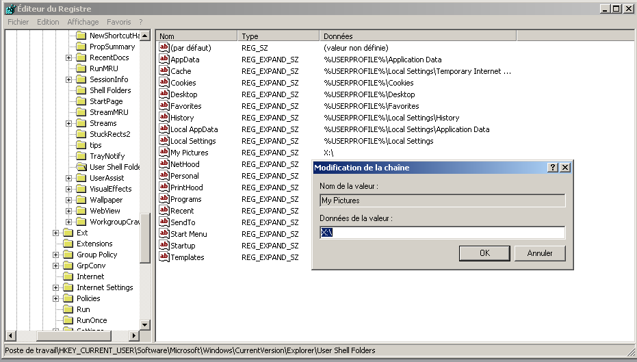
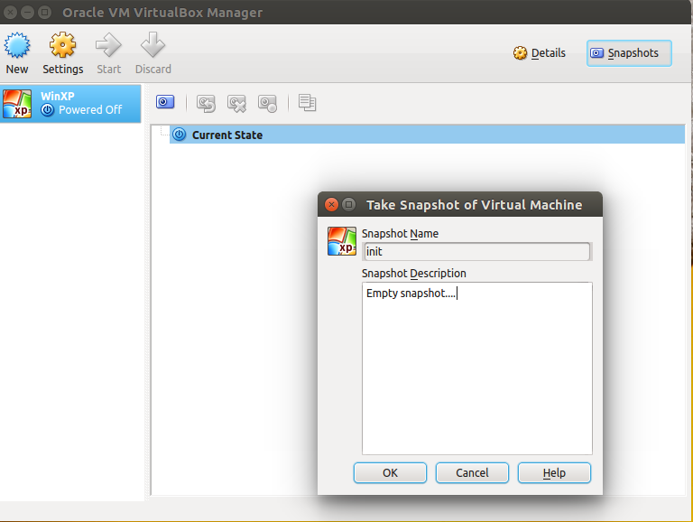

+++
author = "Blagovest Petrov"
title = "Quick way to setup VirtualBox VM in multi user environment"
date = "2015-01-14"

tags = [
    "VirtualBox",
]
categories = [
    "System Administration",
    "Virtualization"
]
+++ 

Let's assume that we need to setup VirtualBox VM with Windows XP and an old version of Microsoft Office. The machine must be used from everyone on a given number of Linux workstations. The workstations may work with LDAP and NFS/Cifs. The standard installation of the VM would be extremely space consuming and it would cost a lot of the personal life of the administrator.
I made an easy hack to solve this ( this is real setup in university labs).

Let's install a standard local Windows XP virtual machine and permanently mount the local directories `/home/trendafil` and `/media` .
In this example, the home directory of the user will be mounted on `X:\\` on Windows and media will be `Z:\\` .

The important directories are out of the VM. So, the virtual machine will be runned from snapshot on every boot.
The next useful step is to move the default user profile outside the VM. I don't need something different than `My Documents` but in other cases, everything from the profile can be exported to `/home`, outside the VM. So, open `regedit` in Windows and go to the

```
HKEY_CURRENT_USER\Software\Microsoft\Windows\CurrentVersion\Explorer\Shell User Folders
```
and change the key `My Documents` to `X:\\`



Turn off the VM and create an empty snapshot:


Next, move the VM from `~/VirtualBox VMs` to `~/.config/VirtualBox` if it's the official VirtualBox edition or `~/.VirtualBox` for the open source edition from the Ubuntu repositories. 

Open the file `~/.config/VirtualBox/VirtualBox.xml` and clean it from the unnecessary stuff: 
```xml
<ExtraDataItem name="GUI/RecentFolderHD"......;
<ExtraDataItem name="GUI/RecentListHD" ....... and etc..
```

Change the location of the VM and replace your username with `_CURRENTUSR_` everywhere inside the file, like this:
```xml
 <MachineRegistry>
      <MachineEntry uuid="{64245cfc-36c6-4112-9869-d5b9da817fca}" src="/home/_CURRENTUSR_/.VirtualBox/WinXP/WinXP.vbox"/>
    </MachineRegistry>

...

    <SystemProperties defaultMachineFolder="/home/_CURRENTUSR_/VirtualBox VMs" defaultHardDiskFormat="VDI" VRDEAuthLibrary="VBoxAuth" webServiceAuthLibrary="VBoxAuth" LogHistoryCount="3" exclusiveHwVirt="true"/>
```

Also, replace the username the same way in `~/.VirtualBox/WinXP/WinXP.xml`

Change the location of the harddisk image to `/var/vbox/` like this: 
```xml
        <HardDisk uuid="{c052dc96-569b-4873-a799-2a75497404db}" location="/var/vbox/winxp.vmdk" format="VMDK" type="Normal">
```

Create the directory `/var/vbox/` and then move the harddisk image from `~/.VirtualBox/WinXp/winxp.vmdk` to `/var/vbox` .

Then, move the whole `~/.VirtualBox` or `~/.config/VirtualBox` to `/var/vbox`

Install Zenity if it's not installed:
```bash
$ sudo apt-get install zenity
```

Put the following script to `/usr/local/bin/startwin`:
```bash
#!/bin/bash

# "THE BEER-WARE LICENSE" (Revision 42):
# <blagovest ;at; petrovs d0t info> wrote this file.
# As long as you retain this notice youcan do whatever you want with
# this stuff. If we meet some day, and you thinkthis stuff is worth it,
# you can buy me a beer in return.   Blagovest Petrov

# "~/.VirtualBox" is for the open source edition.
# Change it to "~/.config/VirtualBox for the Oracle edition.

(

echo "30" ; sleep 1
echo "# Preparing the Virtual Machine to start"; sleep 1
rm -rf ~/.VirtualBox
cp -r /var/vbox/WinXp/.VirtualBox ~/.VirtualBox

echo "50" ; sleep 1
echo "# Configuring the Virtual Machine"; sleep 1
sed -i "s/_CURRENTUSR_/$USER/g" ~/.VirtualBox/WinXP/WinXP.vbox
sed -i "s/_CURRENTUSR_/$USER/g" ~/.VirtualBox/VirtualBox.xml

echo "99" ; sleep 1
echo "# Starting Windows..."; sleep 1
VBoxManage startvm WinXP

echo "100" ; sleep 1
echo "# Starting Windows..."; sleep 1

) |
zenity --progress \
       --title="Starting Windows..." \
       --text="Preparing the Virtual Machine to start" \
       --percentage=0 \
       --auto-kill \
       --auto-close

if [ "$?" = -1 ] ; then
   zenity --error --text "Starting canceled."
fi
```

and make it executable:
```bash
$ sudo chmod +x /usr/local/bin/startwin
```

It should work now. Every user of the system can start the VM from the script. 

Additionaly, you can create a desktop enry.
First, find an ugly Window$ logo with an open license and put it on `/usr/share/icons/win.png`. Then, create the file `/usr/share/applications/startwin.desktop` with this content: 

```ini
[Desktop Entry]
Encoding=UTF-8
Version=1.0
Name=Windows XP
GenericName=Windows XP
Type=Application
Exec=/usr/lcal/bin/startwin
TryExec=/usr/local/bin/startwin
Icon=/usr/share/icons/win.png
Categories=Emulator;System;Application;
Comment=WindowsXP VirtualBox WM
```


