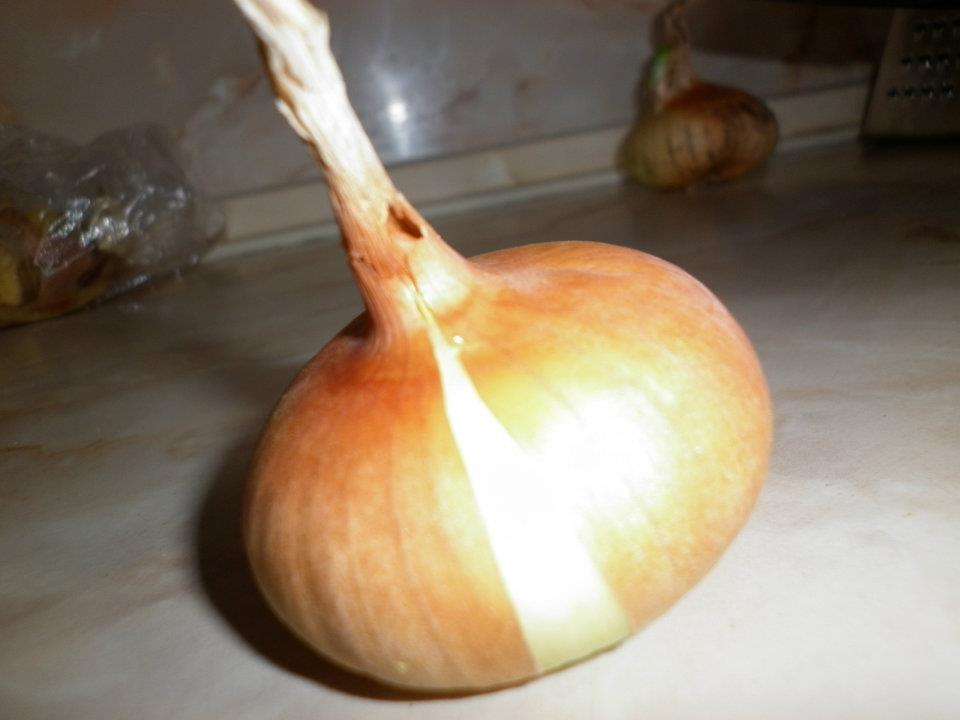

+++
author = "Blagovest Petrov"
title = "How to cook Patatnik"
date = "2015-03-08"

tags = [
    "Patatnik",
]
categories = [
    "Cooking"
]
+++  

This is my first non technical post here. I'm going to explain in details my way to cook Patatnik - Bulgarian dish from the Rhodopi Mountains. It's made of shredded potatoes, eggs, onions, cheese and some local spices. I'm not sure if this is the most authentic recipe but it's the way I like it.

## What is needed for two servings:
1. 3 - 4 medium potatoes;
2. A head of an onion;
3. 3 eggs;
4. ~100g. of white cheese (Sirene. It's famous in the balkans. Something similar is the greek Féta but it's too greasy. In western europe, Sirene can be found in the Polish shops (in UK) and the arabic markets);
5. Sprig of Spearmint (in Bulgarian it's called Dzhodzhen or Gyozum, the latin name is Mentha Spicata. This spice is very suitable for potatoes and beans.);
6. Salt. Instead of salt I'm using "Chiirska merudiya". It's a type of grass which is crushed with salt and dried. I don't know the official name of the plant. It's known and called "Chiirska merudiya" in the region of Trakia in Bulgaria. It's very simmilar to "Nectaroscordum siculum ssp. bulgaricum" which is used the same way, with salt. 

### First, peel the potatoes:

### After that, cut the onion into small pieces:

### Shred the potatoes to thinny pieces:

### Squeeze the potatoes by hand to dehidrate them (That's my way?!):

... and throw the water

### Add the onion:

### Add the eggs and the cheese: 

The cheese and the eggs can be smashed and mixed previously.

### Add the spices and then mix everthing again:

This is how a jar of home made merudia looks like

### Grease two clay plates with some oil:

### Put the mixture in the plates and bake it:

It must be baked on 220°c between 30 and 60 minutes. Depends of the humidity of the mixture.

### ... and voilà! Serve it with [Ayran](http://en.wikipedia.org/wiki/Ayran) and something spicy ;)
