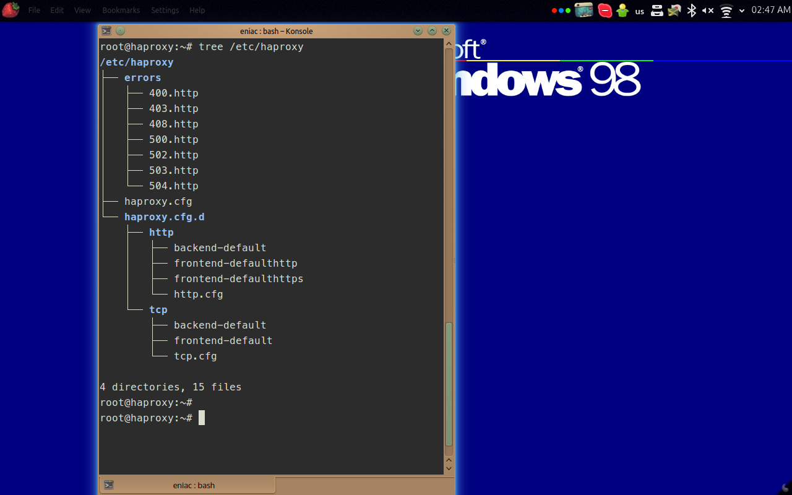

+++
author = "Blagovest Petrov"
title = "HAProxy build with more Debian-like configuration"
date = "2016-02-07"

tags = [
    "Backup",
    "SQL",
]
categories = [
    "System Administration",
    "DevOps",
    "Databases"
]
+++ 

I made a HAProxy build with Debian-style config file because some of the `haproxy.cfg` files on my servers became really big.
HAProxy has an option to include multiple config files as a command line arguent, like this: `haproxy -f haproxy.cfg -f haproxy2.cfg -f...etc`. 

So, the algoritm is like:

1. Read /etc/haproxy/haproxy.cfg (The global settings);
2. Read /etc/haproxy/haproxy.cfg.d/http/http.cfg (Global settings for HTTP);
3. Read /etc/haproxy/haproxy/cfg.d/http/frontend-* (HTTP frontends);
4. Read /etc/haproxy/haproxy.cfg.d/http/backend-* (HTTP backends);
5. Read /etc/haproxy/haproxy.cfg.d/tcp/tcp.cfg (Global settings for TCP);
... and the same as for HTTP

### TODO:

* PPA:
I have some problems with *Quilt* and *debuild* but *dpkg-buildpackage* runs?
* Systemd script.

## [Download](https://github.com/eniac111/haproxy-debianconfig/releases/tag/1.6.3)