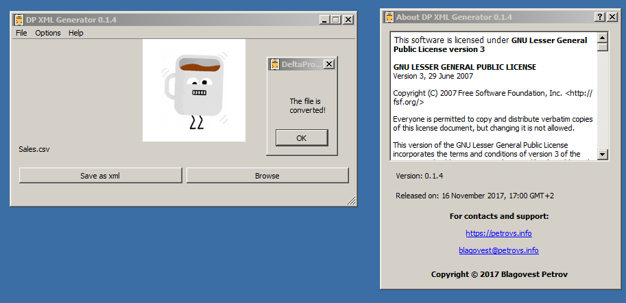

## DeltaProXmlGen

Two years ago I made a small desktop program for my girlfriend's company. It converts XLS financial statements from the Amazon web store to Microinvest DeltaPro. It's really simple but working solution that is saving some manual data entry time. 

A new version is planned for the future. The most important functionality which is missing is the automatic currency conversion based on the current date of the invoice and calculation of VAT by country.

### [CODE](https://code.petrovs.info/blago/DeltaProXmlGen)