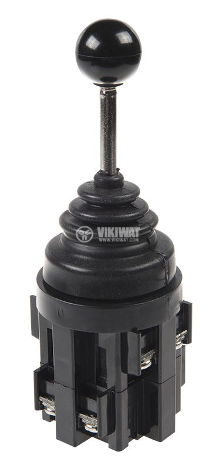
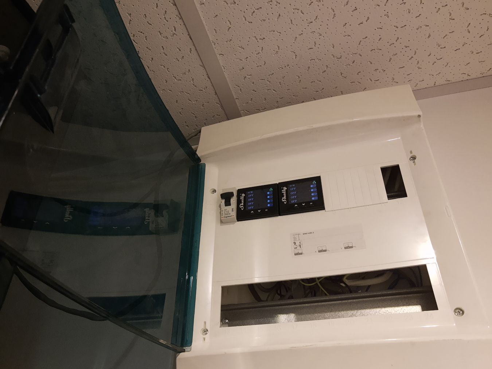
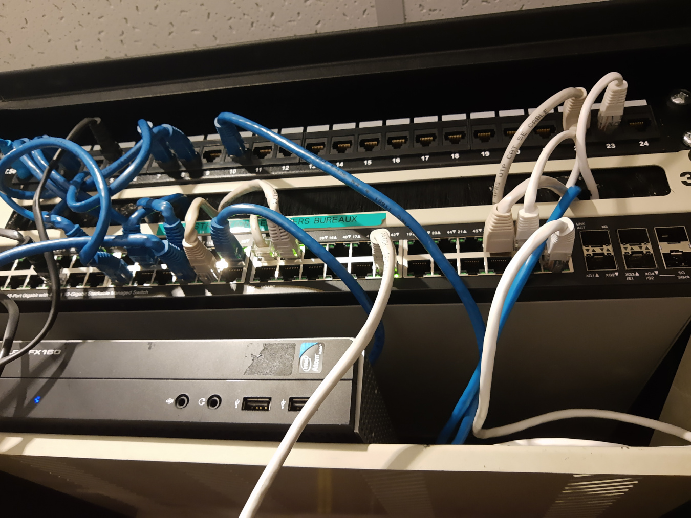

In this way, it's really comfortable to control the lamps without trying to find the switches at night :)

I made it with [two industrial joysticks](https://vikiwat.com/djoistik-ms-4p-4-pozicii-1no-nezadyrzhasht.html) bought from a local hardware shop. The signal is going to the electrical rack in my storage room. I'm using two smart relays - [Shelly Pro 4PM](https://shelly.cloud/knowledge-base/devices/shelly-pro-4pm/) made by a Bulgarian company. They are enough to control the lights in the whole apartment. I have used several impulse relays by Schneider in the past. They are with better quality but outsourcing the smart logic inside the relay makes the setup easier. Now I have only two FTP cables between the electrical rack and the network rack. They are mounted to the patch panel. Everything is controlled by Home Assistant which is installed on a Raspberry Pi 4 but this is not the topic. The joysticks are not smart. They are used instead of buttons.



 

The joystick:

This is the electrical `DIN` rack with the relays

And this is the network rack. They are patched directly on the sockets at right.
