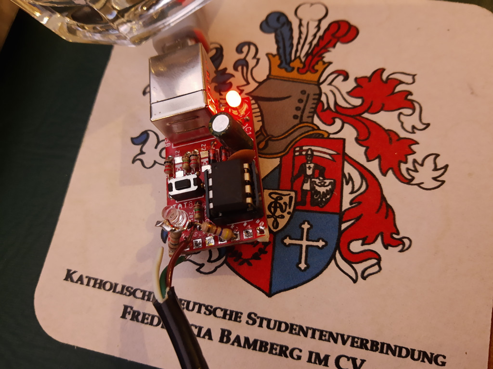


 

# Update
So, [here](https://code.petrovs.info/blago/project_shaiba/src/branch/master/rotary_keyboard.ino)  is the code. It's really simple gadget. The whole setup took me less than a hour for building and coding.

I got the rotary dialer from a local auction site, like Ebay. My first idea was to include everything inside it's box and leave only the USB cable outside but it was encapsulated and I didn't have any success for opening it. Originally, the cable had 5 pin DIN connector but only three pins were connected ( White, Brown and Green): 
 * `Green`: Ground `⏚`
 * `Brown`: Impulse pin. It's used for counting the impulses. Tje pin outputs `1` on equal intervals. 
 * `White`: It's always `UP` if the encoder is rotating. I didn't use this one because the `millis()` is enough counting the time. It may overflow after some time, but I'm thinking about this in the time of writing this post :)

 The board that I used it [OLIMEXINO-85-ASM](https://www.olimex.com/Products/Duino/AVR/OLIMEXINO-85-ASM/open-source-hardware). I got a bunch unsoldered some time ago.  It's clone of the Digispark board with ATtiny85 controller. A really cheap board with software implementation of USB :)) `DigiKeyboard.h`.

 The `Brown` pin is connected to Pin 2 of the board, as it's shown in Instructables.

 TODO: Removing the USB-B port and wiring USB-A cable directly to the PCB; Possible case for the board.

Update2: It's even funnier using it with a mobile phone. Works perfect with USB-C to A converter.

