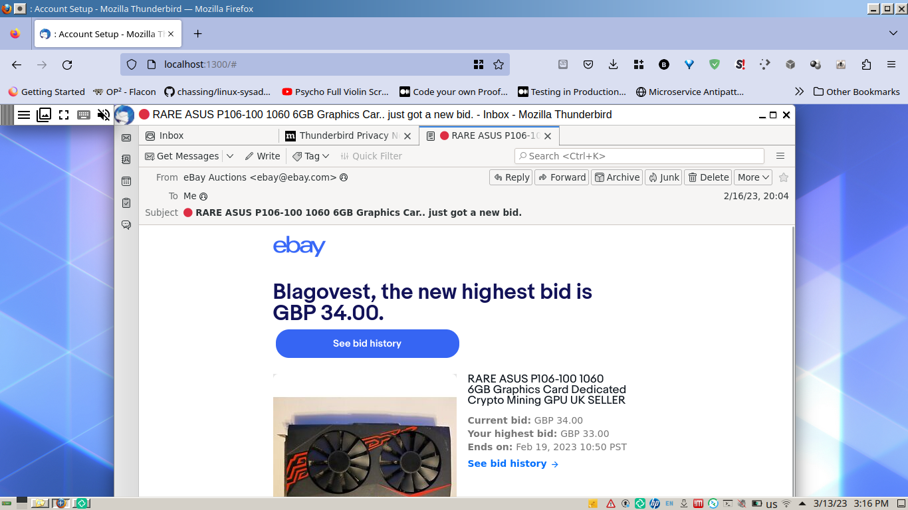

Old project which is useful for QA testing of mail servers and mail security appliances. In the time, it was needed for testing one mail account with different configurations. 

# [The code is here](https://code.petrovs.info/blago/thunderbird_docker_xpra)
 

