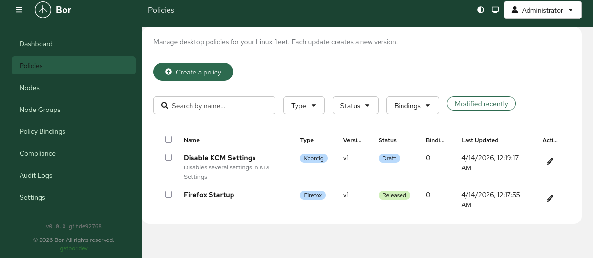

This blog does not get updated very often, and there is a simple reason for that: most of my free time goes into a side project called **[Bor](https://getbor.dev/)**. After more than a year of evenings and weekends spent on it, it deserves a proper introduction here.

## What is Bor

Bor is an open-source **policy management platform for Linux desktops**. The core idea can be summarized in one sentence: define, distribute, and enforce desktop configuration policies across a fleet of machines — in real time.

Windows administrators have had this for decades in the form of Group Policy. On Linux, the equivalent simply did not exist as a cohesive tool: configuration is scattered across dconf, KConfig, polkit, browser policy files, and package managers, and every organization ends up gluing these together with scripts. Bor turns them into centrally managed, versioned policies:

* **Central server** — a single Go binary backed by PostgreSQL, with a web console for authoring policies, organizing nodes into groups, and role-based access control. No message queues, no external dependencies.
* **Lightweight agent** — a static binary packaged as deb, rpm, apk, and for Arch Linux, which maintains a persistent gRPC stream to the server. Policy changes reach the machines in seconds, not on the next scheduled run.
* **Policy types** — Firefox and Chrome/Chromium policies, KDE KConfig (the Kiosk framework), GNOME dconf, polkit rules, Flatpak applications, and — since [v0.7.0](https://getbor.dev/blog/) — package and repository management.

## Why it matters: compliance and security

Managing desktops is ultimately a security exercise, and this is where most of the engineering effort has gone:

* **Continuous enforcement.** The agent does not just apply a configuration once — it watches the managed files and restores them if a user or a piece of malware tampers with them. Every tamper event is reported.
* **Tamper-evident audit log.** Every policy change, enrollment, and administrative action is recorded server-side, which is exactly what auditors ask for.
* **Strong cryptography by default.** All agent communication runs over mandatory mTLS with an internal CA (ECDSA, TLS 1.3 enforced), agent certificates rotate automatically every 90 days, and the cryptographic module is FIPS 140-3 validated (CAVP certificate A6650), aligned with BSI TR-02102-1. The CA key can optionally live in a PKCS#11 HSM.
* **Zero-touch enrollment.** On domain-joined machines the agent enrolls via Kerberos with no operator involvement; otherwise a short-lived one-time token does the job.
* **Enterprise identity.** LDAP and Active Directory integration with group-to-role mapping, TOTP MFA, and WebAuthn/passkeys for the console.

These are not checkbox features. Regulations such as **NIS2** now apply to a very broad set of organizations in the EU, and they require demonstrable control over endpoint configuration, auditability, and incident visibility. A fleet of Linux desktops managed by ad-hoc shell scripts cannot demonstrate any of that.

## The EU moment

The timing for a tool like this is not accidental. The European public sector is in the middle of a genuine shift toward Linux and digital sovereignty. The [EU OS](https://thenewstack.io/eu-os-a-european-proposal-for-a-public-sector-linux-desktop/) initiative — started by Robert Riemann of the European Data Protection Supervisor — proposes a standardized Linux desktop for public administrations. France went further: [DINUM announced](https://interoperable-europe.ec.europa.eu/collection/open-source-observatory-osor/news/france-phases-out-proprietary-operating-systems-workstations) that government workstations will move away from proprietary operating systems, with every ministry required to present an implementation plan by autumn 2026 — following earlier moves like Schleswig-Holstein's migration in Germany.

Migrating hundreds of thousands of desktops to Linux is the visible part. The less visible part is the question every IT department asks on day two: *how do we manage them?* The Windows world answers with Group Policy and Intune; a sovereign Linux desktop needs an equivalent that is **self-hosted, open source, and auditable**. Bor is licensed under LGPLv3, runs entirely on-premises with no cloud dependency, and integrates with the directory services these organizations already operate (FreeIPA, Samba/AD, LDAP). That is precisely the profile that sovereignty-driven procurement is looking for.

## Why not just Ansible?

This is the most frequent question I get, so it earned [a slide of its own at TuxCon 2026](https://getbor.dev/publications/tuxcon2026/). Infrastructure-as-code tools — Ansible, Puppet, Salt — are excellent at what they are built for: **provisioning**. Bor is not trying to replace them; it occupies a different layer: **continuous enforcement**. The difference matters most exactly in the environments governments and schools operate:

* **Point-in-time vs. continuous.** An Ansible run converges a machine once. Whatever a user changes afterwards stays changed until the next run. Bor's agent detects the drift and reverts it immediately — which is the whole point in a classroom where students are actively probing the boundaries.
* **Push over SSH vs. persistent agents.** Desktops are not servers: they are turned off, they roam, they sit behind NAT. A push model over SSH scales poorly there. Bor's agents connect outbound, stream deltas, and resynchronize automatically after being offline.
* **Playbooks vs. policy semantics.** A browser policy or a KDE lockdown in Bor is a first-class, versioned object with priorities and group bindings — not a template buried in a repository that only one person understands.
* **Operational overhead.** A school rarely has a DevOps team. Bor's server is one binary plus PostgreSQL, and enrollment of a new machine is a token or a Kerberos join. That is a realistic operating model for a municipality or a school district.

The two categories compose well: use Ansible to install the OS and the Bor agent, then let Bor own the desktop configuration for the rest of the machine's life.

## Where to look next

The project is developed in the open by [Vute Tech](https://getbor.dev/) and contributors:

* Website and documentation: [getbor.dev](https://getbor.dev/)
* Source code: [github.com/VuteTech/Bor](https://github.com/VuteTech/Bor) (LGPLv3)
* Release announcements and news: [the Bor blog](https://getbor.dev/blog/)
* The TuxCon 2026 talk with the full architecture deep-dive: [Enterprise Linux Desktop Policy Management](https://getbor.dev/publications/tuxcon2026/)
* [Video tutorials on YouTube](https://www.youtube.com/watch?v=TfOnHZc2vg4&list=PLRXRA0yaZ5T_0y8awfifPeMIsU33qU2QB) covering installation and the main workflows

Issues, pull requests, and feedback are very welcome. And if your organization is looking at the post-Windows era on the desktop — I would genuinely like to hear what policy types you need next.
