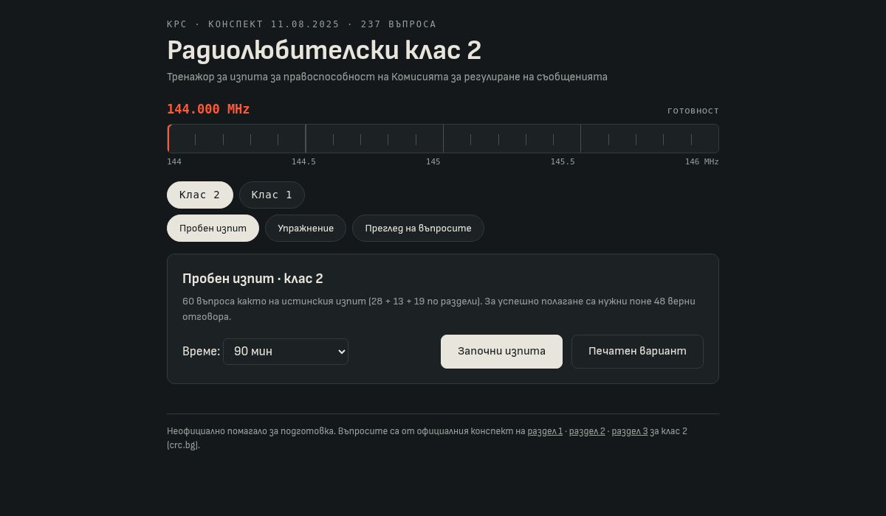

*Note: this post is in Bulgarian, as it concerns the Bulgarian amateur radio license exam held by the Communications Regulation Commission (CRC).*

## Какво направих

От известно време имам намерение да се явя на изпита за радиолюбителска правоспособност. При прегледа на материалите за подготовка установих, че официалните въпроси на [Комисията за регулиране на съобщенията (КРС)](https://crc.bg/) са достъпни само като PDF файлове — по един на раздел, без удобен за упражнение формат и без интерактивен начин за проследяване на напредъка.

Затова направих **[crc-exam.blago.cloud](https://crc-exam.blago.cloud/)** — безплатен изпитен тренажор за клас 1 и клас 2, който работи изцяло в браузъра.

## Съдържание и режими на работа

Тренажорът покрива пълния официален конспект на КРС (актуализация от 11.08.2025 г.) — общо **611 въпроса**:

* **Клас 2** — 237 въпроса в три раздела: „Електротехника и радиотехника“, „Правила и процедури за работа“ и „Национални и международни правни разпоредби“.
* **Клас 1** — 374 въпроса: „Електротехника и радиотехника“, „Кодове и радиолюбителски съкращения. Правила и процедури“ и „Нормативна уредба“.

Има три режима на работа:

* **Пробен изпит** — 60 въпроса като на истинския изпит, разпределени пропорционално между разделите, с таймер (по подразбиране 90 минути). За успешно полагане са необходими поне 48 верни отговора (80%). Резултатите се съхраняват локално, което позволява проследяване на напредъка от предишните опити.
* **Упражнение** — избират се раздели и брой въпроси, а верният отговор се показва веднага след всеки въпрос.
* **Преглед на въпросите** — целият конспект, раздел по раздел, с търсене.

Към **всеки от 611-те въпроса има кратко обяснение** защо верният отговор е верен. Целта е материалът да се разбира, а не да се наизустяват отговори — знанията са необходими и след изпита, при реална работа в ефир.

## Техническа реализация

Реализацията е умишлено възможно най-проста:

* Чист HTML и vanilla JavaScript — без framework и без build стъпка.
* Без backend, регистрация и проследяване. Въпросите се зареждат като статични файлове, а историята на резултатите се съхранява единствено в `localStorage` на браузъра.
* Интерфейсът е адаптиран и за мобилни устройства.
* Предвиден е и **печатен вариант** за упражнение на хартия.

Индикаторът за напредък е стилизиран като скала на радиоприемник: при клас 2 стрелката се движи по 2-метровия обхват (144–146 MHz), а при клас 1 — по 40-метровия.

## Отворен код

Изходният код и въпросите са публикувани в [Git хранилище](https://code.blago.cloud/blago/radio_operator_course_questions). Тренажорът е неофициално помагало — въпросите са извлечени от официалните PDF файлове на КРС. Ако забележите грешка в отговор или обяснение, можете да ми пишете или да изпратите pull request.

Надявам се тренажорът да бъде полезен на радиолюбителската общност в България и на всички, които се подготвят за придобиване на правоспособност. Самият аз възнамерявам един ден да се явя на изпита.

73!
