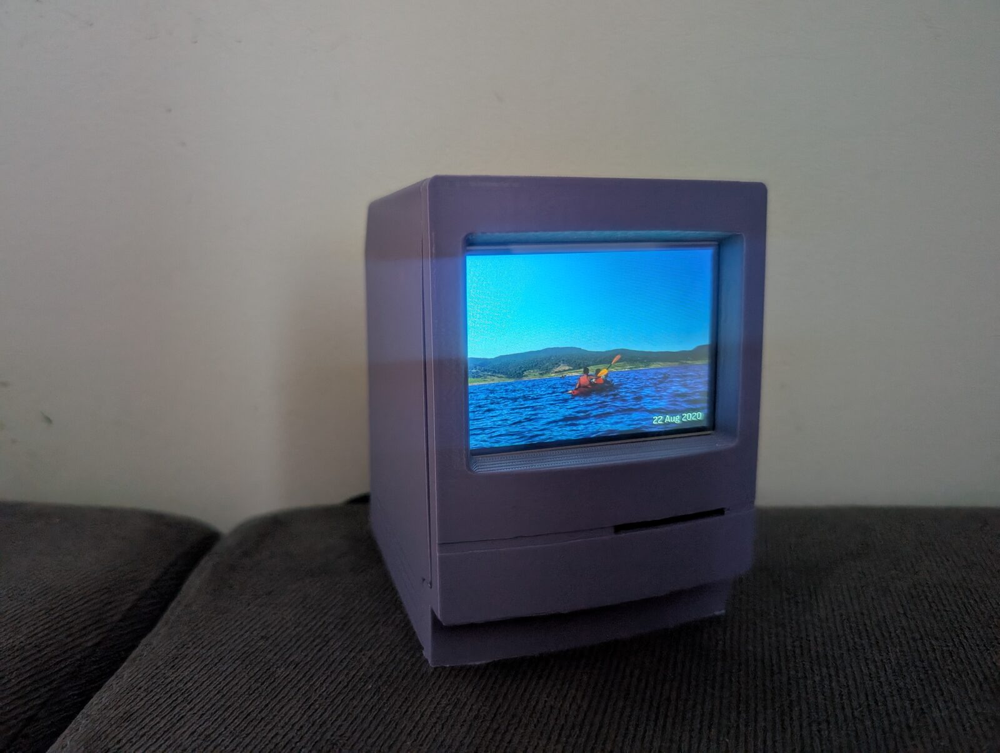
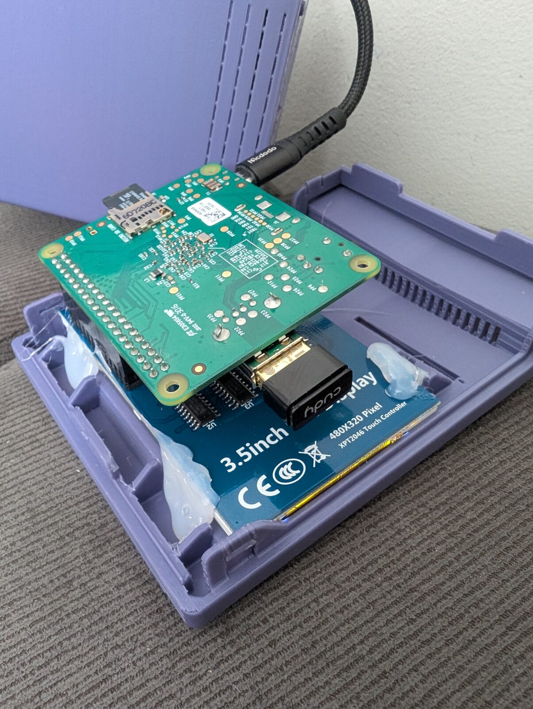
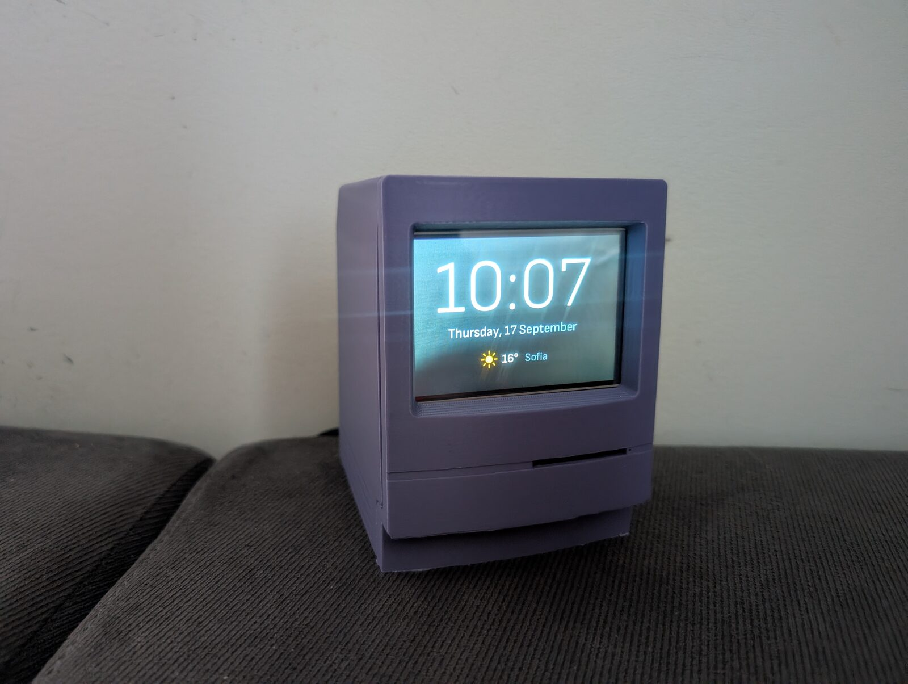
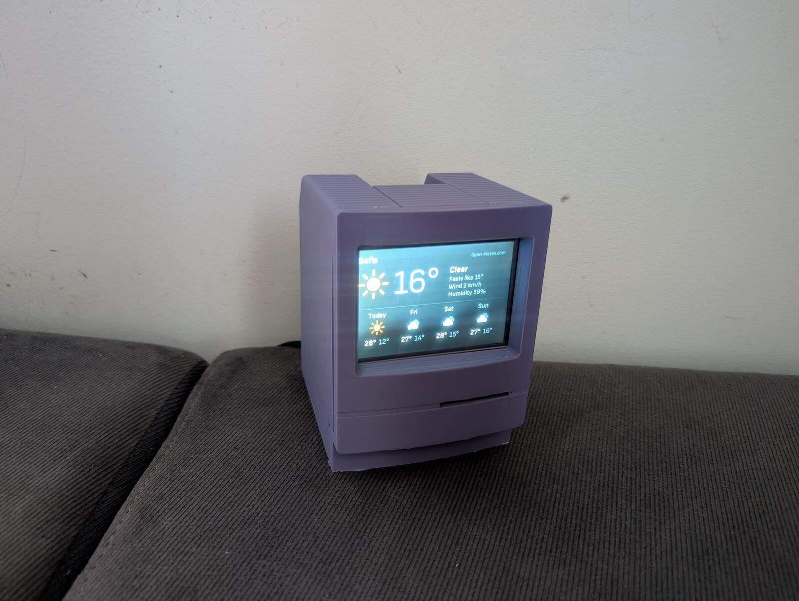
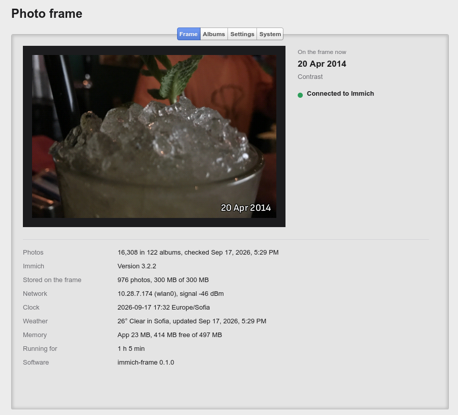

My photos live on a self-hosted [Immich](https://immich.app) server. It is great for browsing and backups, but the photos rarely get looked at unless someone opens the app. So I built a small photo frame around an original **Raspberry Pi Model A+** that shows photos from selected Immich albums.

## The hardware

This is what I had in the cabinet. The image is built especially for this hardware, but it could be easily ported to other boards and displays:

* **Raspberry Pi Model A+**: a single-core ARMv6 CPU at 700 MHz, no NEON, no network and no real-time clock. Mine has 512 MB of RAM, but the software is designed for the original 256 MB boards.
* **LCDwiki 3.5" RPi Display (MPI3501)**: 480×320, ILI9486 controller over SPI, with a resistive XPT2046 touch panel. It plugs straight onto the GPIO header.
* **Cudy WU650S** USB WiFi adapter (Realtek RTL8811CU) in the Pi's only USB port.
* A microSD card and a solid 5 V power supply. The WiFi dongle alone can draw 500 mA.

Everything fits in a small 3D-printed case shaped like a classic Macintosh, which suits a device with a 700 MHz CPU nicely. The case is [this Mac model from Thingiverse](https://www.thingiverse.com/thing:6460144), made by [kimgooni](https://www.thingiverse.com/kimgooni/designs). It was designed for a 3.5" display of the same size, so my panel fit without any changes. The hot glue was not even necessary :).

## What it does

* A **slideshow** of photos from chosen albums (or all albums, minus exclusions). Shared albums work too. The order can be shuffled (each photo once per round), newest first or oldest first.
* Photos are fitted to the 3:2 screen automatically: cropped when their shape is close, otherwise placed over a blurred copy of themselves. A small caption shows the date, the location and the album.
* A **full-screen clock** after every few photos, and an optional **weather slide** from [Open-Meteo](https://open-meteo.com/) (free, no API key). Both use a blurred copy of the previous photo as a background.
* **Touch**: tap for the next photo, hold for the clock, hold again for the weather.
* **Night mode**: the screen goes black on a schedule. The backlight on this panel is hard-wired on, so "black" is the best software can do.
* **Cache**: Some photos are cached on the SD card, so after the first run the frame starts showing photos immediately, even without a network.

Setup is meant to be done from any PC. The SD card's FAT boot partition holds two files: `immich-frame.toml` (the Immich address, an API key and the albums) and a regular `wpa_supplicant.conf` for WiFi. The API key only needs `album.read`, `asset.read` and `asset.view`, since it sits on the card in plain text. After the first boot there is also a small web page on the frame for choosing albums, changing settings and installing updates.

The **Frame** tab shows what is on the screen right now, along with the state of the device. On my library of 16,308 photos in 122 albums, the frame keeps 976 ready-to-show photos in its 300 MB cache, and the app itself uses only 23 MB of RAM.

Every problem a user can run into is shown on the screen itself: a bad API key, a misspelled album name, no network, waiting for the clock to sync. The display is the only UI the frame has, so an error that only ends up in a log file is useless.

## The software

### One Rust binary, no GUI toolkit

With a single ARMv6 core and a tight memory budget, there is no room for X11, a browser in kiosk mode or Qt. The frame is a single **Rust** program that draws directly to the panel's framebuffer:

* Every slide is a full-screen image pushed over a slow SPI link (about 6 fps at 16 MHz), so there are no animations, only hard cuts, and the screen is redrawn only when the picture changes. A widget toolkit would add little.
* No async runtime on a single core: two plain threads, one syncing with Immich and preparing photos, the other running the slideshow.
* The frame always downloads Immich's `preview` rendition, never the originals. Each photo is decoded once, fitted to 480×320, converted to RGB565 with ordered dithering (to avoid banding in skies) and cached as a ready-to-blit frame. Only one image is decoded at a time.

It is written against Immich 3.x and speaks both the older flat search API and the newer structured one, so it keeps working when the server gets upgraded.

The same program runs on a PC, writing frames as PNG files or opening a window, so most development happens there, against a mock server or a real Immich instance, before anything goes onto the card.

### A custom Linux image with Yocto

Instead of Raspberry Pi OS, the frame runs a minimal image built with **Yocto** (Wrynose 6.0 LTS) using [kas](https://kas.readthedocs.io) in a container. It boots with sysvinit and BusyBox, and contains little beyond the kernel, the WiFi stack and the frame program. A few of the lessons learned:

* **No RTC** means TLS certificate checks fail until NTP has synced, so the app waits for a flag from BusyBox's `ntpd` and shows cached photos in the meantime.
* The rtw88 driver in Linux 6.18 has a bug on 2.4 GHz ("failed to get tx report from firmware"). The image carries a backport of the upstream fix.
* WiFi failed with a misleading "wrong password" message until the kernel crypto modules that `mac80211` loads by name at runtime were added to the image.
* The SPI panel stays white until something forces a mode set, so the app does that itself when it opens the framebuffer.

### Safe updates

A frame on a shelf should never need re-flashing, so updates use **RAUC** with an A/B layout and U-Boot. The SD card has two system partitions. An update, uploaded through the web page, goes into the one that is not running, and the frame reboots into it. The new system must reach Immich within 10 minutes. If it doesn't, the frame restarts, and after three failed attempts it goes back to the previous system. Bundles have to be signed with the builder's key. The whole install-and-rollback path can be tested without hardware, in QEMU's Raspberry Pi A+ emulation.

## Source code

The project is open source under the GPLv3: **[code.blago.cloud/blago/immich_frame](https://code.blago.cloud/blago/immich_frame)**. The README covers the parts list, setting up the SD card, the configuration options and building the image yourself. Be warned: the first Yocto build takes several hours and 50–90 GB of disk space.

If you have an old Pi and a small display lying around, give it a try. Feedback and pull requests are welcome.

## Credits

* The case: [Macintosh model on Thingiverse (thing:6460144)](https://www.thingiverse.com/thing:6460144) by [kimgooni](https://www.thingiverse.com/kimgooni/designs). Thanks for sharing the design!
* [Immich](https://immich.app), the self-hosted photo library the frame shows photos from.
* [Open-Meteo](https://open-meteo.com/) for the free weather data.
* [Sofia Sans](https://github.com/lettersoup/Sofia-Sans) fonts (SIL Open Font License) for all the text on the screen.
* [Cappuccino](https://github.com/cappuccino/cappuccino), the framework behind the frame's web page.
